# TP2 - API de Pedidos de Pizzería

## Descripción
API REST desarrollada con TypeScript + Express + Zod + Vitest aplicando metodología TDD (Test-Driven Development) para gestionar pedidos de pizzería.

---

## Tecnologías utilizadas
- **Node.js** 18+
- **TypeScript** 5.9.2
- **Express** 5.1.0
- **Zod** 4.1.11 - Validación de esquemas
- **Vitest** 3.2.4 - Testing framework
- **Supertest** 7.1.4 - Tests de integración HTTP
- **UUID** 13.0.0 - Generación de IDs

---

## Instalación y configuración

### Prerequisitos
- Node.js 18 o superior
- npm

### Pasos de instalación
```bash
# Clonar el repositorio
git clone https://github.com/ralbalboa/Programacion-IV.git

# Navegar al directorio del proyecto
cd TP2

# Instalar dependencias
npm install

# Compilar TypeScript
npm run build
```

---

## Scripts disponibles

```bash
# Ejecutar tests con cobertura
npm test

# Compilar TypeScript en modo watch
npm run build

# Ejecutar servidor en modo desarrollo
npm run dev
```

---

## Endpoints implementados

### 1. POST /orders
Crea una nueva orden de pizza.

**Request Body:**
```json
{
  "orderSize": "M",
  "toppings": ["mozzarella", "tomate"],
  "address": "Calle Falsa 123"
}
```

**Validaciones:**
- `orderSize`: Debe ser "S", "M" o "L"
- `toppings`: Array de strings, mínimo 1, máximo 5 elementos
- `address`: String de mínimo 10 caracteres

**Response (201 - Created):**
```json
{
  "id": "550e8400-e29b-41d4-a716-446655440000",
  "orderSize": "M",
  "toppings": ["mozzarella", "tomate"],
  "address": "Calle Falsa 123",
  "status": "pending",
  "price": 5400
}
```

**Ejemplo curl:**
```bash
curl -X POST http://localhost:3000/orders \
  -H "Content-Type: application/json" \
  -d '{
    "orderSize": "M",
    "toppings": ["mozzarella", "tomate"],
    "address": "Calle Falsa 123"
  }'
```

---

### 2. GET /orders/:id
Obtiene una orden específica por su ID.

**Response (200 - OK):**
```json
{
  "id": "550e8400-e29b-41d4-a716-446655440000",
  "orderSize": "M",
  "toppings": ["mozzarella", "tomate"],
  "address": "Calle Falsa 123",
  "status": "pending",
  "price": 5400
}
```

**Response (404 - Not Found):**
```json
{
  "message": "Orden no encontrada"
}
```

**Ejemplo curl:**
```bash
curl http://localhost:3000/orders/550e8400-e29b-41d4-a716-446655440000
```

---

### 3. POST /orders/:id/cancel
Cancela una orden existente.

**Reglas de negocio:**
- No se puede cancelar una orden con status "delivered"

**Response (200 - OK):**
```json
{
  "id": "550e8400-e29b-41d4-a716-446655440000",
  "status": "canceled",
  "message": "Orden cancelada exitosamente"
}
```

**Response (404 - Not Found):**
```json
{
  "message": "Orden no encontrada"
}
```

**Response (409 - Conflict):**
```json
{
  "message": "No se puede cancelar una orden que ya fue entregada"
}
```

**Ejemplo curl:**
```bash
curl -X POST http://localhost:3000/orders/550e8400-e29b-41d4-a716-446655440000/cancel
```

---

### 4. GET /orders?status={status}
Obtiene todas las órdenes filtradas por estado.

**Query params:**
- `status` (opcional): "pending" | "delivered" | "canceled"

**Response (200 - OK):**
```json
[
  {
    "id": "550e8400-e29b-41d4-a716-446655440000",
    "orderSize": "M",
    "toppings": ["mozzarella"],
    "address": "Calle Falsa 123",
    "status": "pending",
    "price": 4700
  }
]
```

**Ejemplo curl:**
```bash
# Obtener todas las órdenes
curl http://localhost:3000/orders

# Filtrar por status
curl http://localhost:3000/orders?status=pending
```

---

## Reglas de negocio

1. **Tamaños de pizza:**
   - S (Small): $3000
   - M (Medium): $4000
   - L (Large): $5000

2. **Toppings:**
   - Precio por topping: $700
   - Mínimo: 1 topping
   - Máximo: 5 toppings

3. **Precio total:**
   - Precio = Precio base (según tamaño) + (cantidad de toppings × $700)

4. **Estados de orden:**
   - `pending`: Orden recién creada
   - `delivered`: Orden entregada
   - `canceled`: Orden cancelada

5. **Restricciones:**
   - No se puede cancelar una orden con status "delivered"
   - La dirección debe tener al menos 10 caracteres

---

## Matriz de Casos de Prueba

| ID Caso | Descripción | Precondición | Input | Acción | Resultado esperado | Test |
|---------|-------------|--------------|-------|--------|-------------------|------|
| **CA1** | Crear orden válida con tamaño M | Ninguna | `orderSize: "M"`, `toppings: ["mozzarella"]`, `address: "Calle Falsa 123"` | POST /orders | 201 - Orden creada con precio calculado (4700) | `POST /orders - creates order successfully` |
| **CA2** | Obtener orden por ID válido | Orden existe | `id: <uuid válido>` | GET /orders/:id | 200 - Retorna orden completa | `GET /orders/:id - returns order` |
| **CA3** | Cancelar orden pendiente | Orden con status "pending" | `id: <uuid válido>` | POST /orders/:id/cancel | 200 - Orden cancelada exitosamente | `POST /orders/:id/cancel - cancels pending order` |
| **CA4** | Filtrar órdenes por status | Existen órdenes | `status: "pending"` | GET /orders?status=pending | 200 - Array de órdenes con status "pending" | `GET /orders?status - filters orders` |
| **CA5** | Crear orden con 5 toppings (máximo) | Ninguna | `toppings: [5 elementos]` | POST /orders | 201 - Orden creada correctamente | `POST /orders - accepts max toppings` |
| **ERR1** | Orden con items vacíos | Ninguna | `toppings: []` | POST /orders | 422 - Error de validación | `POST /orders - rejects empty toppings` |
| **ERR2** | Orden con más de 5 toppings | Ninguna | `toppings: [6 elementos]` | POST /orders | 422 - "No puede tener más de 5 toppings" | `POST /orders - rejects too many toppings` |
| **ERR3** | Orden con dirección muy corta | Ninguna | `address: "Corta"` | POST /orders | 422 - "La dirección debe tener al menos 10 caracteres" | `POST /orders - rejects short address` |
| **ERR4** | Obtener orden inexistente | Ninguna | `id: <uuid inválido>` | GET /orders/:id | 404 - "Orden no encontrada" | `GET /orders/:id - returns 404` |
| **ERR5** | Cancelar orden entregada | Orden con status "delivered" | `id: <uuid válido>` | POST /orders/:id/cancel | 409 - "No se puede cancelar una orden que ya fue entregada" | `POST /orders/:id/cancel - rejects delivered order` |
| **ERR6** | Orden con tamaño inválido | Ninguna | `orderSize: "XL"` | POST /orders | 422 - Error de validación | `POST /orders - rejects invalid size` |

---

## Estructura del proyecto

```
TP2/
├── src/
│   ├── app.ts                 # Configuración de Express (makeApp)
│   ├── index.ts               # Servidor HTTP
│   ├── controllers/
│   │   └── orderController.ts # Controladores HTTP
│   ├── models/
│   │   └── Order.ts           # Modelo de dominio Order
│   ├── services/
│   │   └── orderService.ts    # Lógica de negocio
│   ├── routes/
│   │   └── orderRoutes.ts     # Definición de rutas
│   ├── types/
│   │   └── orderTypes.ts      # Schemas Zod y tipos TypeScript
│   └── tests/
│       ├── orderCrud.test.ts  # Tests unitarios
│       └── integration.test.ts # Tests de integración HTTP
├── package.json
├── tsconfig.json
├── vitest.config.ts
└── README.md
```

---

## Evidencia de TDD

### Ciclo Rojo → Verde → Refactor aplicado

El desarrollo se realizó siguiendo estrictamente la metodología TDD (Test-Driven Development). A continuación se documenta el proceso completo con capturas de pantalla.

---

### 📋 Metodología TDD

1. **🔴 ROJO**: Escribir test que falla (la funcionalidad no existe)
2. **🟢 VERDE**: Implementar código mínimo para que el test pase
3. **🔵 REFACTOR**: Mejorar código manteniendo tests en verde

---

## Feature 1: `createOrder` - Crear orden

### 🔴 Paso 1: Test ROJO
Escribimos el test unitario antes de implementar el método:

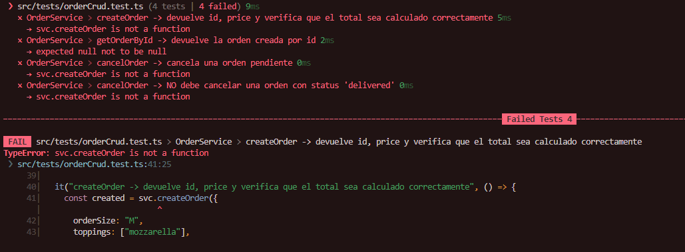

**Resultado:** ❌ El test falla porque `svc.createOrder is not a function`

### 🟢 Paso 2: Implementación VERDE
Implementamos el código mínimo en `orderService.ts`:

```typescript
public createOrder(orderData: CreateOrder): Order {
    const newOrder = new Order(orderData.orderSize, orderData.toppings, orderData.address);
    orders.push(newOrder);
    return newOrder;
}
```

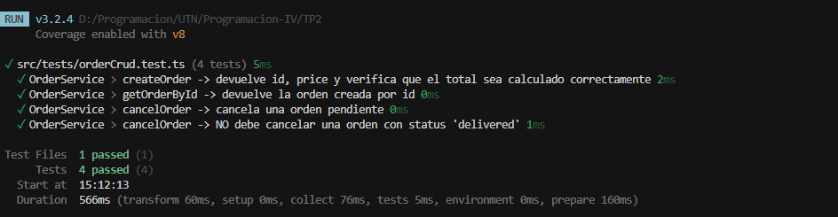

**Resultado:** ✅ El test pasa exitosamente

---

## Feature 2: `getOrderById` - Obtener orden por ID

### 🔴 Paso 1: Test ROJO

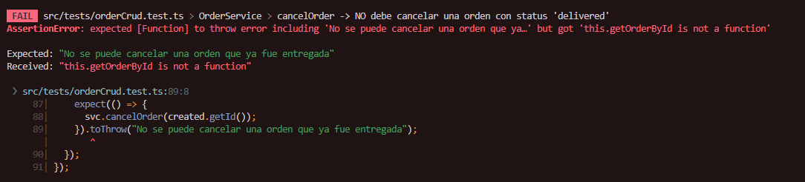

**Resultado:** ❌ Falla porque `getOrderById is not a function`

### 🟢 Paso 2: Implementación VERDE

```typescript
public getOrderById(id: string): Order | null {
    const order = orders.find(o => o.getId() === id);
    return order || null;
}
```

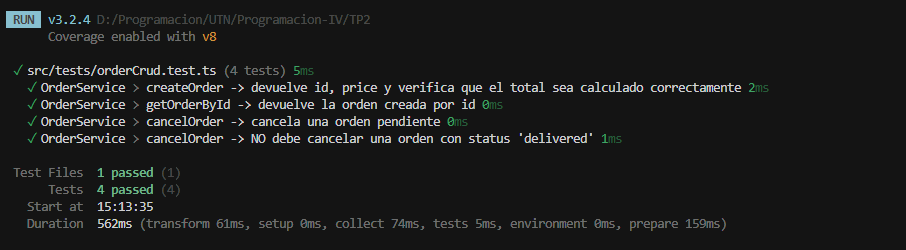

**Resultado:** ✅ Test en verde

---

## Feature 3: `cancelOrder` - Cancelar orden (lógica básica)

### 🔴 Paso 1: Test ROJO

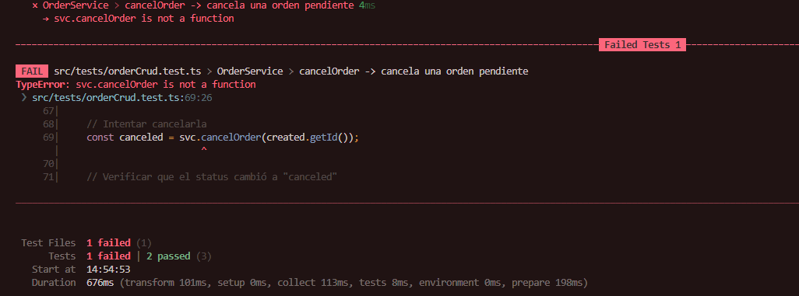

**Resultado:** ❌ `svc.cancelOrder is not a function`

### 🟢 Paso 2: Implementación VERDE

```typescript
public cancelOrder(id: string): Order {
    const order = this.getOrderById(id);
    if (!order) {
        throw new Error("Order not found");
    }
    order.setStatus("canceled");
    return order;
}
```

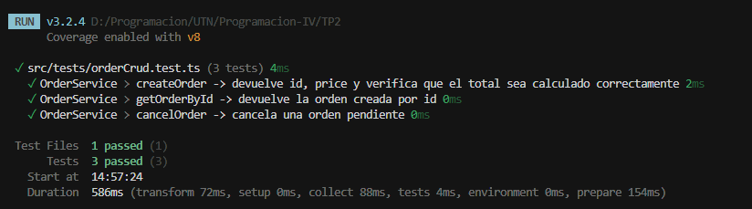

**Resultado:** ✅ Test básico pasa

---

## Feature 4: `cancelOrder` - Validación de negocio (no cancelar si delivered)

### 🔴 Paso 3: Test ROJO (Refactor con validación)

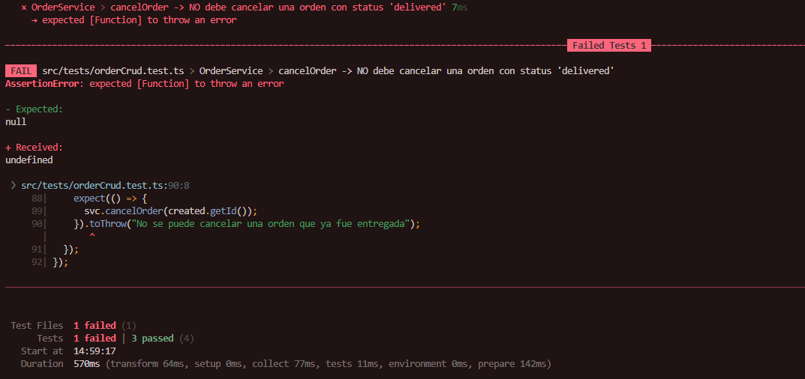

**Resultado:** ❌ Falla porque aún no validamos el status "delivered"

### 🟢 Paso 4: Refactor VERDE

```typescript
public cancelOrder(id: string): Order {
    const order = this.getOrderById(id);
    if (!order) {
        throw new Error("Order not found");
    }

    // REGLA DE NEGOCIO: No se puede cancelar si ya fue entregada
    if (order.getStatus() === "delivered") {
        throw new Error("No se puede cancelar una orden que ya fue entregada");
    }

    order.setStatus("canceled");
    return order;
}
```


**Resultado:** ✅ Regla de negocio implementada correctamente

---

## Feature 5: Tests de integración HTTP - Validaciones (Error 422)

### 🔴 Paso 1: Test ROJO

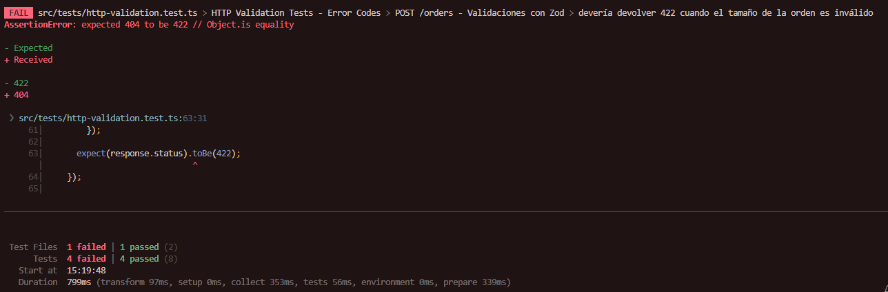

**Resultado:** ❌ El controller devuelve 400 en lugar de 422

### 🟢 Paso 2: Ajuste del controller VERDE

Cambiamos el status code de validación de Zod de `400` a `422`:

```typescript
if (!parsed.success) {
    return res
      .status(422)  // ← Cambio de 400 a 422
      .json({ message: "Datos inválidos", errors: parsed.error });
}
```

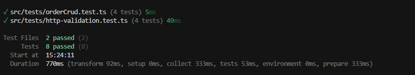

**Resultado:** ✅ Todos los tests de validación pasan con código 422

---

## Feature 6: POST /orders/:id/cancel - Endpoint HTTP

### 🔴 Paso 1: Test ROJO

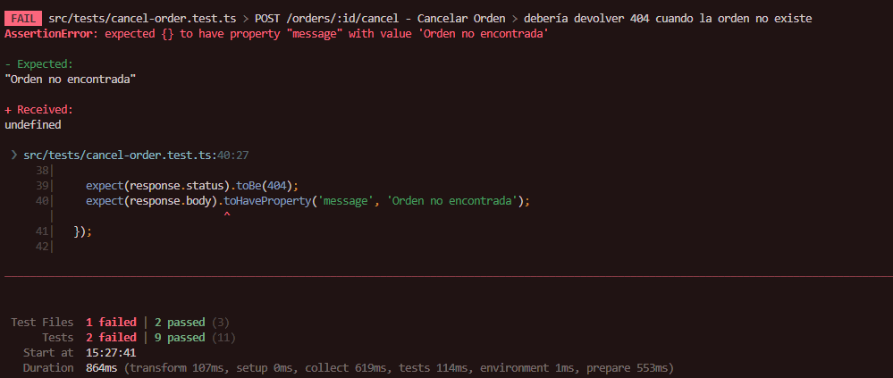

**Resultado:** ❌ Ruta `/orders/:id/cancel` no existe (404)

### 🟢 Paso 2: Implementación del controller y ruta

```typescript
// Controller
export const cancelOrder = (req: Request, res: Response) => {
  const { id } = req.params;
  const orderService = new OrderService();

  try {
    const canceledOrder = orderService.cancelOrder(id);
    res.status(200).json({
      id: canceledOrder.getId(),
      status: canceledOrder.getStatus(),
      message: "Orden cancelada exitosamente"
    });
  } catch (error) {
    if (error.message === "Order not found") {
      return res.status(404).json({ message: "Orden no encontrada" });
    }
    if (error.message === "No se puede cancelar una orden que ya fue entregada") {
      return res.status(409).json({ message: error.message });
    }
    return res.status(500).json({ message: "Error cancelando la orden" });
  }
};

// Ruta
router.post("/:id/cancel", cancelOrder);
```

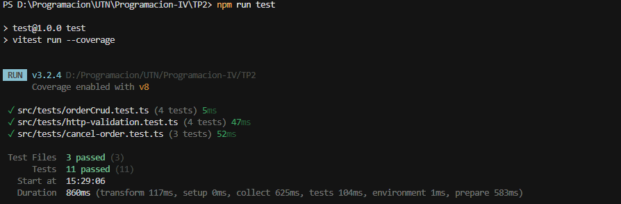

**Resultado:** ✅ Endpoint funcionando correctamente

---

## Feature 7: GET /orders?status - Filtrar órdenes

### 🔴 Paso 1: Test ROJO

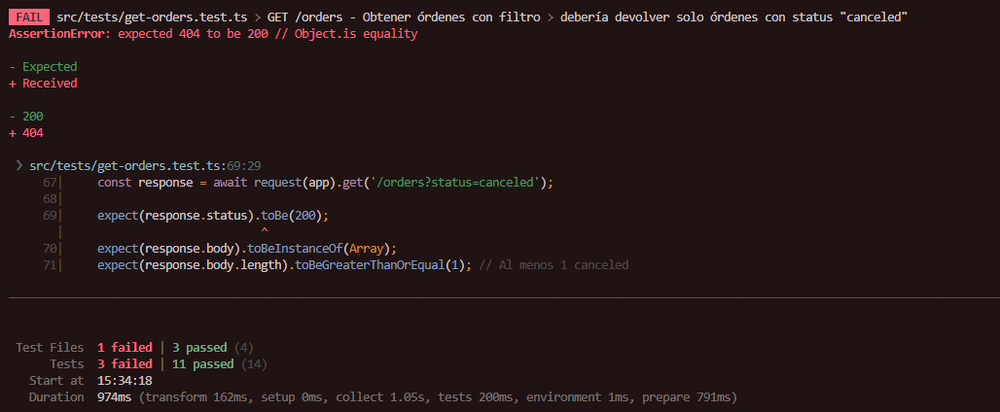

**Resultado:** ❌ Ruta `GET /orders` no existe

### 🟢 Paso 2: Implementación completa

**Servicio:**
```typescript
public getOrdersByStatus(status?: string): Order[] {
    if (!status) {
        return orders;
    }
    return orders.filter(order => order.getStatus() === status);
}
```

**Controller:**
```typescript
export const getAllOrders = (req: Request, res: Response) => {
  const { status } = req.query;
  const orderService = new OrderService();

  try {
    const orders = orderService.getOrdersByStatus(status as string | undefined);
    res.status(200).json(orders);
  } catch (error) {
    return res.status(500).json({ message: "Error obteniendo las órdenes" });
  }
};
```

**Ruta:**
```typescript
router.get("/", getAllOrders);
```

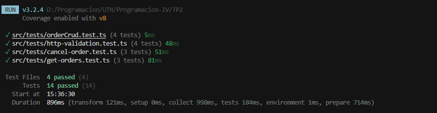

**Resultado:** ✅ Filtrado por status funcionando correctamente

---

## 📊 Resumen del proceso TDD

| Feature | Test Rojo | Implementación | Test Verde | Refactor |
|---------|-----------|----------------|------------|----------|
| createOrder | ✅ | ✅ | ✅ | N/A |
| getOrderById | ✅ | ✅ | ✅ | N/A |
| cancelOrder (básico) | ✅ | ✅ | ✅ | ✅ |
| cancelOrder (validación) | ✅ | ✅ | ✅ | N/A |
| Validaciones HTTP 422 | ✅ | ✅ | ✅ | N/A |
| POST /orders/:id/cancel | ✅ | ✅ | ✅ | N/A |
| GET /orders?status | ✅ | ✅ | ✅ | N/A |

**Total de ciclos TDD:** 7 features completas siguiendo Rojo → Verde → Refactor

---

## Cobertura de tests

Ejecutar: `npm test`

**Objetivos:**
- ✅ Cobertura ≥ 80% en archivos modificados
- ✅ Tests unitarios de reglas de negocio
- ✅ Tests de integración de endpoints HTTP

**Reporte de cobertura obtenido:**
```
File                 | % Stmts | % Branch | % Funcs | % Lines |
---------------------|---------|----------|---------|---------|
All files            |   81.17 |    86.66 |   73.68 |   81.17 |
 controllers         |   63.63 |       60 |      75 |   63.63 |
  orderController.ts |   63.63 |       60 |      75 |   63.63 |
 models              |      84 |      100 |   63.63 |      84 |
  Order.ts           |      84 |      100 |   63.63 |      84 |
 routes              |     100 |      100 |     100 |     100 |
  orderRoutes.ts     |     100 |      100 |     100 |     100 |
 services            |     100 |      100 |     100 |     100 |
  orderService.ts    |     100 |      100 |     100 |     100 |
 types               |     100 |      100 |     100 |     100 |
  orderTypes.ts      |     100 |      100 |     100 |     100 |
```

**✅ Cobertura total: 81.17%** - Cumple con el requisito de ≥ 80%

**Destacados:**
- 🟢 **Services (100%)**: Toda la lógica de negocio está completamente testeada
- 🟢 **Routes (100%)**: Todas las rutas HTTP cubiertas
- 🟢 **Types/Validations (100%)**: Schemas Zod completamente validados

---

## User Stories implementadas

- [x] **HU-01**: Como cliente, quiero crear un pedido de pizza especificando tamaño, toppings y dirección
- [x] **HU-02**: Como cliente, quiero consultar el estado de mi pedido por ID
- [x] **HU-03**: Como cliente, quiero cancelar mi pedido si aún no fue entregado
- [x] **HU-04**: Como administrador, quiero ver todos los pedidos filtrados por estado

---

## Notas adicionales

### Decisiones técnicas
- **Almacenamiento in-memory**: Se usa un array en memoria para simplificar el TP (no se requiere DB real)
- **Separación app/server**: `makeApp()` exporta la app Express sin `listen()` para facilitar tests con Supertest
- **Validación en capas**: Zod valida formato de entrada, servicios validan reglas de negocio

### Testing
- **Vitest** se eligió por su velocidad y compatibilidad nativa con TypeScript
- Los tests de integración usan **Supertest** para simular requests HTTP sin levantar el servidor
