# Proceso de Desarrollo Guiado por Pruebas (TDD)

## Simulador de Pedidos de Cafetería

Este documento presenta el proceso completo de desarrollo del simulador de cafetería siguiendo la metodología **Test-Driven Development (TDD)**

---

## Fase Inicial: Configuración

### Test Inicial Falla

El primer paso del TDD es escribir un test que falle. Esto confirma que el entorno de testing está correctamente configurado y que los tests efectivamente detectan código faltante.

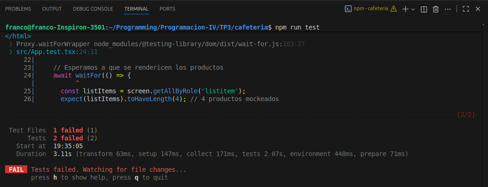

En esta imagen vemos:
- **2 tests fallidos** de la HU1 (Visualización del menú)
- Los tests buscan productos que aún no existen en la implementación
- El framework Vitest está correctamente configurado y ejecutándose

---

## HU1: Visualización del Menú

**Historia de Usuario:** *Como usuario, quiero ver un listado de productos disponibles cuando ingreso al sistema, para poder elegir qué pedir.*

### Verde: Tests Pasan

Después de implementar la funcionalidad mínima para cargar y mostrar el menú, los tests pasan:

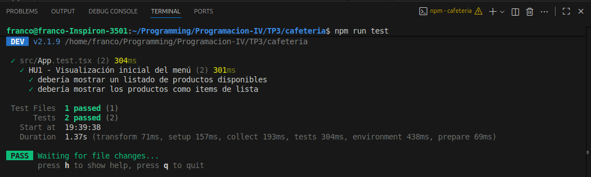

Resultados:
- **2 tests aprobados**
- Se verifica que se muestran los productos del menú
- Se verifica que los productos se renderizan como ítems de lista

### Refactor: Código Mejorado

Tras hacer pasar los tests, refactorizamos el código para mejorar su estructura sin cambiar su comportamiento:

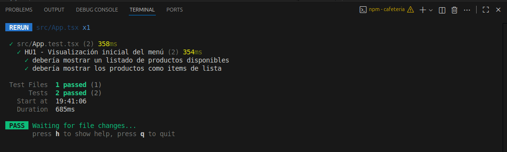

- Los tests siguen pasando después del refactor
- El código está mejor organizado

---

## HU2: Agregar Ítem al Pedido

**Historia de Usuario:** *Como usuario, quiero agregar productos al pedido, para calcular el total.*

### Rojo: Test Falla

Escribimos primero el test que verifica la funcionalidad de agregar ítems:

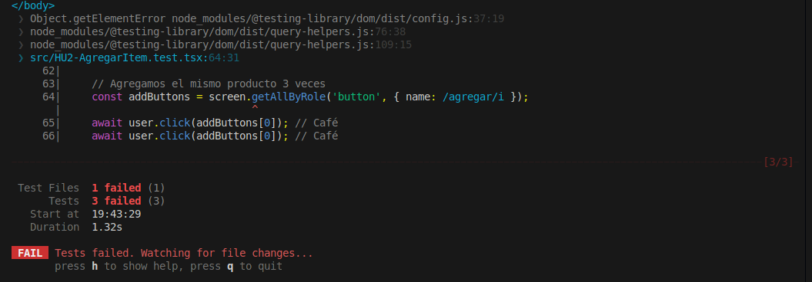

- **3 tests fallidos** (los 2 de HU1 más el nuevo de HU2)
- El test simula clicks en el botón "Agregar"
- Busca elementos con el regex `/agregar/i`

### Verde: Tests Pasan

Implementamos la funcionalidad mínima para agregar ítems al pedido:

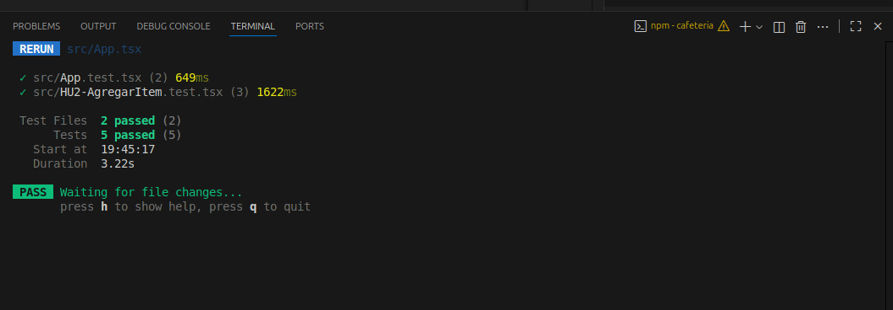

- **5 tests aprobados**
- La funcionalidad de agregar ítems funciona correctamente
- Total acumulado: 3 archivos de test, 5 tests

---

## HU3: Calcular Total del Pedido

**Historia de Usuario:** *Como usuario, quiero ver el total actualizado cada vez que agrego o elimino un producto.*

### Rojo: Test Falla

El test verifica que el total se calcule correctamente:

- **4 tests fallidos**
- El test espera encontrar "Total: $450" en el documento
- Usa regex para validar el formato del total

### Verde: Tests Pasan

Implementamos el cálculo dinámico del total:

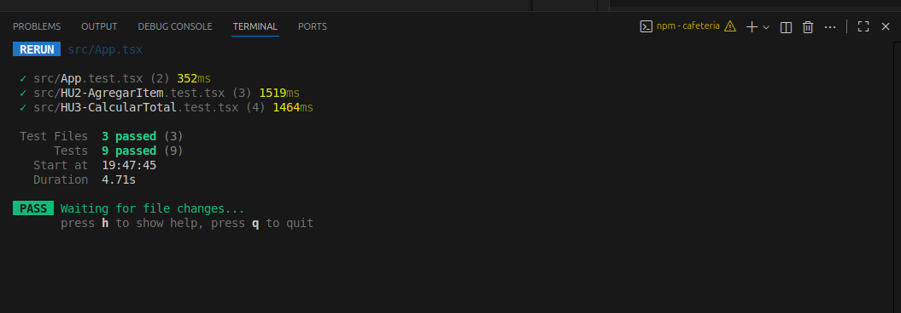

- **9 tests aprobados**
- El cálculo del total funciona correctamente
- 3 archivos de test pasando

---

## HU4: Eliminar Ítem del Pedido

**Historia de Usuario:** *Como usuario, quiero poder quitar un ítem del pedido sin borrar todo.*

### Rojo: Test Falla

El test verifica la funcionalidad de eliminar ítems individuales:

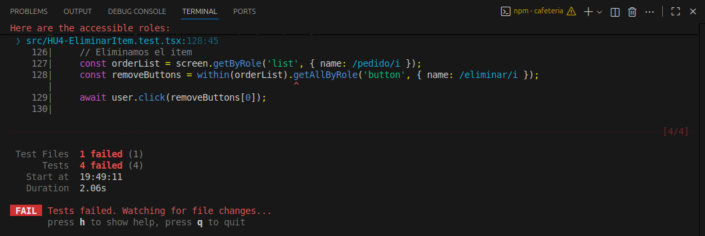

- **4 tests fallidos**
- Busca botones con el nombre `/eliminar/i`
- Verifica que se eliminen elementos de la lista de pedidos

### Verde: Tests Pasan

Implementamos la funcionalidad de eliminar ítems:

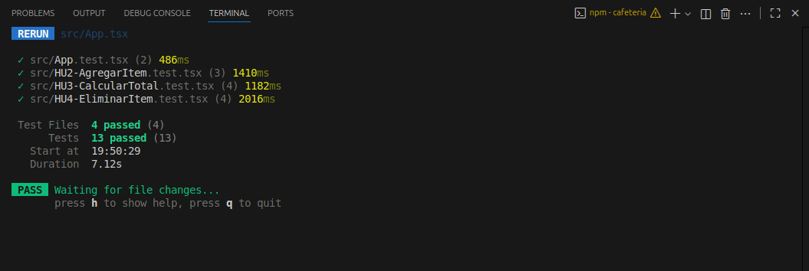

- **13 tests aprobados**
- 4 archivos de test pasando
- La eliminación de ítems funciona correctamente

---

## HU5: Enviar Pedido

**Historia de Usuario:** *Como usuario, quiero enviar mi pedido al servidor para confirmarlo.*

### Rojo: Test Falla

El test verifica el envío del pedido y la confirmación:

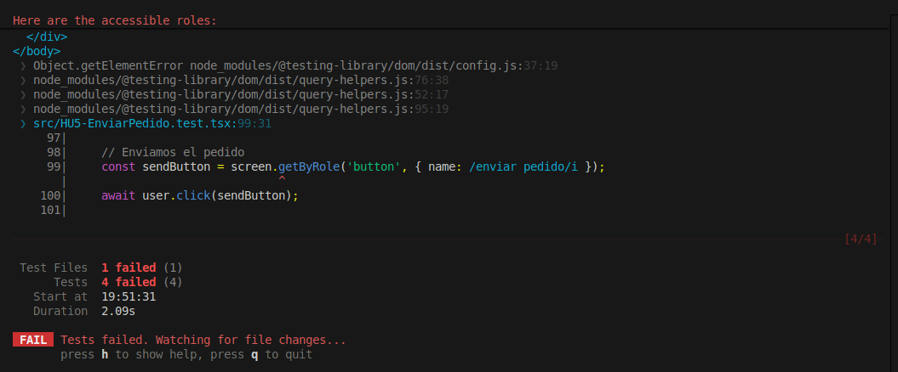

- **4 tests fallidos**
- Busca un botón con el nombre `/enviar pedido/i`
- El test simula el click y espera confirmación

### Verde: Tests Pasan

Implementamos el envío del pedido con MSW:

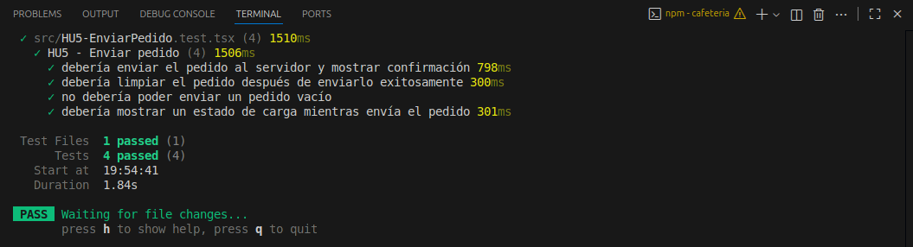

- **4 tests aprobados** en la suite de envío de pedidos
- El pedido se envía correctamente al servidor mockeado
- Se limpia el estado después del envío exitoso
- Todos los tests verifican:
  - Envío del pedido al servidor
  - Limpieza del pedido después del envío
  - Validación de pedido vacío
  - Estado de carga durante el envío

---

## HU6: Casos Límite

**Historia de Usuario:** *Como sistema, debo manejar correctamente errores y casos límite.*

### Rojo: Test con Errores

Durante el desarrollo de casos límite, encontramos errores:

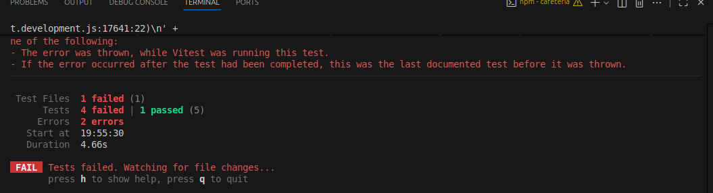

- **1 test fallido**, **1 test aprobado**
- **2 errores** durante la ejecución
- Se detectan problemas con el manejo de errores

### Verde: Todos los Tests Pasan

Después de corregir el manejo de errores y casos límite:

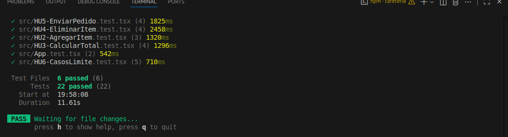

---