# TP4 - Proyecto de Cyberseguridad (Aplicación Vulnerable - Práctica de Seguridad Web)

## Grupo 20

| Integrantes:    
|--------------
Lucía Canclini
Franco Juárez
Mateo Muscolino
Rodrigo Alvarez   
##
### Inicio Rápido

Para clonar el repositorio y ejecutar los tests de seguridad del backend, sigue los siguientes pasos:

### Clonar el repositorio:
```bash
git clone https://github.com/ralbalboa/Programacion-IV
```
### Ejecutar los tests:
```bash

cd TP4/WebApp-Seguridad-Prog4/backend
npm install
npm run test:security
```

Originalmente la prueba inicial de los tests falló, como era esperado:
###
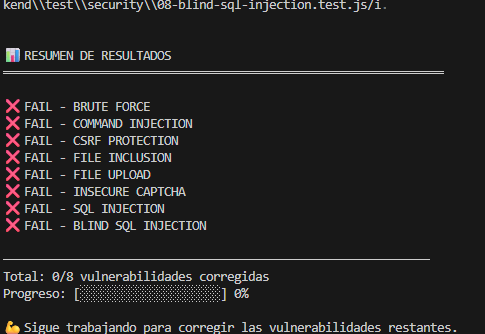

A continuación se procedió a la solución de los siguientes test para lograr que pasen exitosamente:

- [Test 1 - Brute Force](#test-1---brute-force)
- [Test 2 - Command Injection](#test-2---command-injection)
- [Test 3 - CSRF](#test-3---csrf-cross-site-request-forgery)
- [Test 7 - SQL Injection](#test-7---sql-injection)
---

# Test 1 - Brute Force 
Este test valida la protección del endpoint de login (/api/login) contra ataques de Fuerza Bruta. Se identificó la falta de limitación de intentos, se explicó cómo un atacante podría descifrar contraseñas, y se implementaron medidas de Rate Limiting estricto, delay progresivo y registro de logs para mitigar la amenaza.

El primer test individual falló como era de esperarse:
###
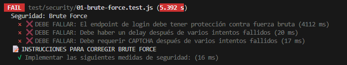
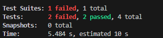

## VULNERABILIDADES IDENTIFICADAS
**Problema:**
- Sin Limitación de Intentos de Login (Rate Limiting)
- El sistema permitía una cantidad ilimitada de intentos de login por segundo desde la misma IP o usuario.
- Esto permitía a los atacantes usar diccionarios o herramientas automatizadas para probar miles de contraseñas.
- El servidor no tenía un mecanismo para ralentizar o bloquear solicitudes excesivas.

**Explotación:**
Un atacante utiliza un script o herramienta (como Hydra o Burp Suite) para enviar continuamente combinaciones de nombres de usuario y contraseñas al endpoint /api/login hasta encontrar una coincidencia válida. Esto es eficiente sin un límite de intentos.

## PATRONES DE SEGURIDAD USADOS
### 1. **Rate Limiting (Limitación de Tasa)**
Se configuró el middleware express-rate-limit. Mediante un mecanismo se limitó a 5 intentos por IP cada 15 minutos, por lo que al exceder el límite, el servidor devuelve un status 429 Too Many Requests. Esto frena drásticamente la velocidad del ataque, haciendo que el proceso de adivinar contraseñas sea ineficiente.

### 2. **Delay Progresivo (Retardo Exponencial)**
Se agregó un retardo exponencial después de cada intento fallido que, por ejemplo, hace que el tiempo de espera aumenta progresivamente (ej. 1s, 2s, 4s, 8s, etc.). Entonces, incluso dentro de la ventana de rate limiting, el delay progresivo aumenta el tiempo total necesario para un ataque exitoso.

### 3. **Registro y Alertas de Fallos (Logging)**
Se implementó el registro de logs para guardar los detalles de cada intento fallido sospechoso (IP, hora, usuario intentado), configurarondo alertas para notificar a los administradores sobre patrones anormales (ej. muchos intentos fallidos desde una única IP o contra una única cuenta). Esto permite la detección temprana y la intervención manual o automatizada (como el bloqueo de IPs) ante un ataque en curso.

Tests exitosos:
###
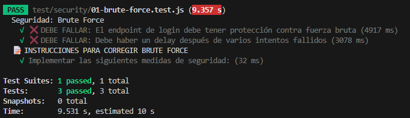

---
# Test 2 - Command Injection
Este test evalúa la seguridad del backend frente a ataques de Inyección de Comandos del Sistema Operativo. La vulnerabilidad clave era el uso inseguro de funciones de ejecución de comandos y la falta de validación de entradas. La solución se centró en la validación estricta, el uso de la función segura spawn y la implementación de una lista blanca de hosts permitidos.

El primer test individual falló como era de esperarse:
###
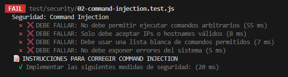
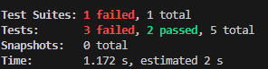

## VULNERABILIDADES IDENTIFICADAS
**Problema:**
- Ejecución de Comandos del Sistema Insegura.
- La aplicación utilizaba funciones peligrosas (como exec) y concatenaba directamente la entrada del usuario en el comando a ejecutar.
- Esto permitía al atacante alterar el comando original inyectando código malicioso.

**Explotación:**
Un atacante ingresa una cadena que contiene un separador de comandos (&&, ;, |, etc.) seguido de un comando malicioso (ej. file.txt && cat /etc/passwd). La aplicación ejecuta el comando inyectado en el servidor, permitiendo al atacante obtener información sensible o modificar el sistema.

## PATRONES DE SEGURIDAD USADOS
### 1. **Uso de child_process.spawn en lugar de exec**
Se implementó el módulo child_process.spawn. Este método trata la entrada del usuario como argumentos simples y separados, y no como parte del comando en sí mismo, eliminando la posibilidad de inyección de código.

### 2. **Validación de Entrada con Regex Estricto**
Se implementó la validación estricta de la entrada del usuario usando expresiones regulares (Regex). Solo se permiten formatos válidos y esperados, como:
IPs válidas: /^\d{1,3}\.\d{1,3}\.\d{1,3}\.\d{1,3}$/
Hostnames válidos: /^[a-zA-Z0-9.-]+$/ Esto rechaza inmediatamente caracteres especiales del shell que se usan para inyección.

### 3. **Implementación de Lista Blanca de Hosts Permitidos**
Se definió un array de hosts permitidos (allowedHosts = ['8.8.8.8', '1.1.1.1', 'google.com']). Solo los valores que coinciden exactamente con la lista son procesados por el backend.

### 4. **Nunca Concatenar Strings para Formar Comandos**
Se reforzó la práctica de no concatenar strings para formar comandos. En su lugar, se utilizan arrays de argumentos para pasar los datos, asegurando que el shell nunca los interprete como código.

### 5. **Sanitizar Mensajes de Error**
Se modificó la gestión de errores para que el servidor nunca exponga errores del sistema operativo al usuario final. Se devuelven mensajes genéricos y controlados para evitar que un atacante obtenga información de depuración valiosa sobre la estructura interna del servidor.

###
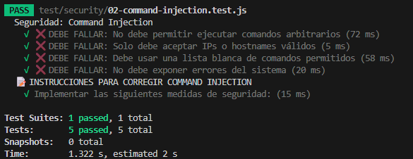

---
# Test 3 - CSRF (Cross-Site Request Forgery)
Este test valida la protección contra ataques CSRF en el endpoint `/api/transfer`. Se identificaron vulnerabilidades, se demostró cómo explotarlas y se implementaron medidas de seguridad.

---

El primer test individual falló como era de esperarse:
###
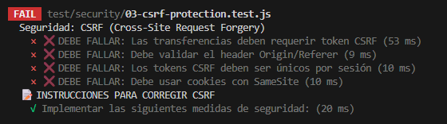
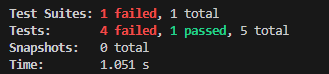


## VULNERABILIDADES IDENTIFICADAS

### Vulnerabilidad 1: Falta de Token CSRF
**Problema:**
- El endpoint `/api/transfer` no requería validación de token CSRF
- Un atacante podía hacer transferencias fraudulentas desde un sitio malicioso
- La transferencia se ejecutaba solo con cookies de sesión válidas

**Explotación:**
El atacante incrusta la URL de transferencia (/api/transfer?to=atacante...) en un elemento (como img o iframe) en un sitio malicioso. El navegador de la víctima envía automáticamente la cookie de sesión, ejecutando la transferencia al cargar el recurso sin su consentimiento.

---

### Vulnerabilidad 2: No Validar Origin/Referer Headers
**Problema:**
- El servidor no verificaba de dónde venía la petición
- Cualquier sitio externo podía hacer requests al endpoint
- No había forma de saber si la petición era legítima o maliciosa

**Explotación:**
- Las cookies se enviaban automáticamente

---

### Vulnerabilidad 3: Cookies Sin SameSite
**Problema:**
- Las cookies de sesión no tenían la directiva `SameSite`
- El navegador enviaba cookies en peticiones cross-site por defecto
- La sesión era válida en cualquier contexto (cross-origin)

**Explotación:**
- Misma como arriba - las cookies se enviaban automáticamente

---

## PATRONES DE SEGURIDAD USADOS

### 1. **Double Submit Cookie Pattern**
- Token almacenado en cookie `_csrf`
- Token también enviado en header `X-CSRF-Token` o body
- Servidor verifica que ambos coincidan
- Seguro porque: atacante no puede leer cookies (httpOnly)

### 2. **SameSite Cookie Attribute**
- Navegador NO envía cookies en peticiones cross-site
- Previene CSRF automáticamente
- Compatible con navegadores modernos

### 3. **Origin/Referer Validation**
- Verifica de dónde vienen las peticiones
- Rechaza peticiones desde orígenes maliciosos
- Defense in depth (capas de seguridad)

Tests exitosos:
###
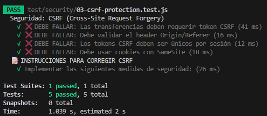

---

# Test 7 - SQL Injection
Este test se enfoca en la protección del backend contra la Inyección SQL. La vulnerabilidad principal era la concatenación directa de la entrada del usuario en consultas SQL. La solución fundamental fue migrar a consultas parametrizadas (Prepared Statements), usar un ORM, e implementar una validación y sanitización estricta de la entrada.

---

El primer test individual falló como era de esperarse:
###
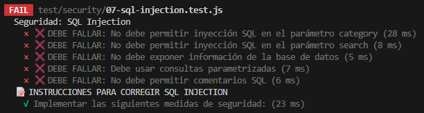
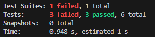


## VULNERABILIDADES IDENTIFICADAS

**Problema:**
- Concatenación Directa en Consultas SQL.
- Se construía la consulta SQL combinando cadenas de texto con las variables de entrada del usuario sin un escape adecuado.
- Esto permitía que los caracteres especiales (como ' o ;) alteraran la estructura de la consulta.

**Explotación:**
Un atacante introduce una cadena que cambia la lógica de la consulta SQL (ej. admin' OR 1=1 --). Esto resulta en la ejecución de código SQL arbitrario por el motor de la base de datos, lo que puede conducir a la extracción de datos sensibles, modificación o eliminación de información.

---

## PATRONES DE SEGURIDAD USADOS

### 1. **Uso de Consultas Parametrizadas / Prepared Statements**
Se implementó el uso de placeholders (?) en la consulta (SELECT * FROM products WHERE category = ?) y se pasaron los valores de entrada en un array de parámetros ([category, '%' + search + '%']). La base de datos trata los valores como datos puros, no como instrucciones SQL.

### 2. **Validación y Sanitización de Entrada (express-validator)**
Se utilizó la librería express-validator para validar y limpiar la entrada del usuario antes de que llegara a la base de datos:

Validación (isAlphanumeric): Asegura que los campos como category contengan solo caracteres alfanuméricos.

Sanitización (escape): Convierte caracteres peligrosos (<, >, &, ', ", /) a sus entidades HTML correspondientes, neutralizando su efecto.

### 3. **Uso de un ORM como Sequelize**
Se migró la lógica de la base de datos a un ORM (Object-Relational Mapper) como Sequelize. Los ORMs manejan internamente las consultas de forma segura, utilizando prepared statements por defecto y ofreciendo una abstracción que evita la necesidad de concatenar strings.

### 4. **Principio de Menor Privilegio**
Se creó un usuario de base de datos con permisos estrictamente limitados. Este usuario solo tiene permisos de SELECT en las tablas necesarias para la aplicación, y carece de permisos peligrosos como DROP, CREATE, o ALTER. Esto reduce el impacto de un ataque SQL Inyection exitoso.

### 5. **Escapar Caracteres Especiales (fallback)**
Como medida de seguridad adicional (Defense in Depth), se utilizó la función de escape del controlador de la base de datos (mysql.escape(category)). Esta función añade slashes o comillas a los caracteres especiales para que sean tratados como datos literales.

### 6. **Nunca Concatenar Strings para Formar Queries**
Se estableció como una regla estricta de desarrollo no concatenar strings para construir consultas SQL, sino usar siempre placeholders (?) y el mecanismo de parámetros de la base de datos.

Tests exitosos:
###
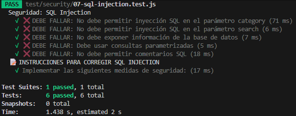